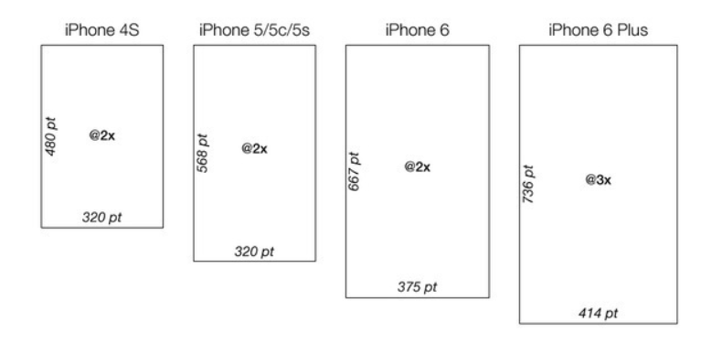
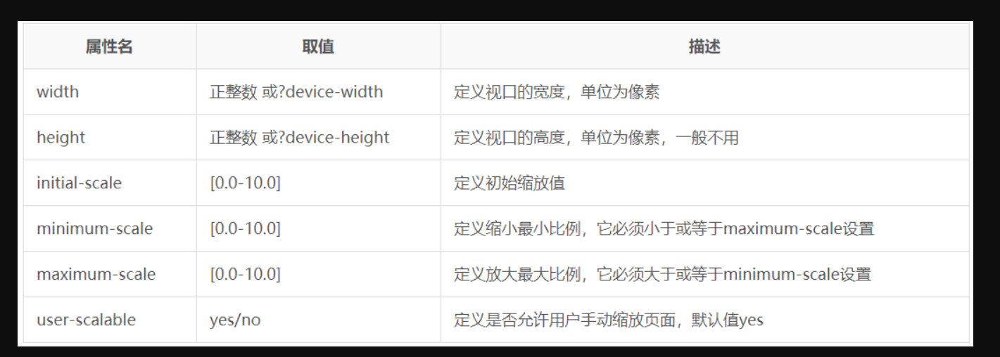

# 基础知识

## 设备像素、设备独立像素、CSS像素、PPI、devicePixelRatio

### 设备像素

设备像素（物理像素 / 像素分辨率）

- 显示器的最小物理单位（对于一个显示器来说是固定的）
- 以手机屏幕为例，iphonex像素分辨率为1125x2436，是指屏幕横向能显示1125个物理像素点，纵向能显示2436个物理像素点。
- 通常说的4K显示屏指的是 4096x2160

### 设备独立像素（dips）

- 比如我们偶尔会说“电脑屏幕在 2560x1600分辨率下不适合玩游戏，我们把它调为 1440x900”，这里的“分辨率”（非严谨说法）指的就是设备独立像素。
- 可在控制台通过 window.screen.width/ window.screen.height 查看。
- 另外，平时我们所说的 iphoneX的逻辑分辨率375 x 812指的就是设备独立像素。chrome检查元素模拟调试手机设备时显示如375x667和 320x480都是设备独立像素。
- 一个设备独立像素可能包含多个物理像素，包含的越多，显示越清晰

### CSS像素

- 在页面不缩放的情况下，1px的CSS像素 === 1设备独立像素
- 页面放大200%时，页面的设备独立像素依旧不变，放大的是CSS像素。但是此时CSS像素与设备独立像素的关系变化了，1px === 4独立像素（宽x2，高x2）

### PPI

- 指每英寸的物理像素数。
- 以尺寸为5.8英寸（屏幕对角线长度）、分辨率为1125x2436的iphonex为例：
- ppi = Math.sqrt(1125_*1125 + 2436*_2436) / 5.8 ，值为 463ppi。（屏幕对角线上的像素点 / 对角线的英寸数）

### devicePixelRatio

- 像素比window.devicePixelRatio
- devicePixelRatio指的是物理像素和设备独立像素的比，即1独立像素由多少物理像素渲染。
- dpr（device pixel ratio）：设备像素比，设备像素/设备独立像素，代表设备独立像素到设备像素的转换关系，在JS中可以通过 window.devicePixelRatio 获取； 
- window.devicePixelRatio = 物理像素 / 设备独立像素（dips）。
- 经计算， iphonex的 devicePixelRatio 是3。

## 高清屏部分图片失真：

- 一些像素比较低的图片，在普通显示屏上可以显示，但在高清屏上会出现模糊的现象
- 原因是：假如有一张图片，设置宽高为100px，在不同屏幕上，呈现的都是100px设备独立像素的图片，但对于高清屏来说，100px独立像素所需的物理像素比普通屏多得多
- 1px独立像素所含的物理像素越多，屏幕越高清;   假如普通屏100px独立像素需要1W个像素点，高清屏得3W个,  但是图片本身包含的像素点可能远远达不到3W，这时候，图片就会拉伸自己的像素点，所以看起来就显得模糊了。
- 解决办法是：高清屏上图片的宽高设小一点，这样所需的物理像素就不用那么多了，屏幕显示图片所需的物理像素越接近图片，图片越高清

矢量图永不失真> - 因为矢量图形不是一个个像素点显色的，而是通过给定的坐标数据进行绘制的，所以不会失真。

## 布局视口与视觉视口

 移动前端中常说的 viewport （视口）就是浏览器显示页面内容的屏幕区域。其中涉及几个重要概念是 dip （ device-independent pixel 设备逻辑像素 ）和 CSS 像素之间的关系。这里首先了解以下几个概念。 

### layout viewport（布局视口）

 一般移动设备的浏览器都默认设置了一个viewport 元标签，定义一个虚拟的layout viewport（布局视口），用于解决早期的页面在手机上显示的问题。iOS, Android基本都将这个视口分辨率设置为 980px，所以pc上的网页基本能在手机上呈现，只不过元素看上去很小，一般默认可以通过手动缩放网页。 

### visual viewport（视觉视口）和物理像素

visual viewport（视觉视口）备物理屏幕的可视区域，屏幕显示器的物理像素，同样尺寸的屏幕，像素密度大的设备，硬件像素会更多。例如iPhone的物理像素：

- iPhone5 ：640 *?1136
- iPhone6：750 *?1334
- iPhone6 Plus：1242 *?2208

### ideal viewport（理想视口）和 dip （设备逻辑像素）

ideal viewport（理想视口）通常是我们说的屏幕分辨率。

dip （设备逻辑像素）跟设备的硬件像素无关的。一个 dip 在任意像素密度的设备屏幕上都占据相同的空间。

比如MacBook Pro的 Retina （视网膜）屏显示器硬件像素是：2880 *?1800。当你设置屏幕分辨率为 1920 * 1200 的时候，ideal viewport（理想视口）的宽度值是1920像素， 那么 dip 的宽度值就是1920。设备像素比是1.5（2880/1920）。设备的逻辑像素宽度和物理像素宽度（像素分辨率）的关系满足如下公式：

逻辑像素宽度*倍率 = 物理像素宽度

而移动端手机屏幕通常不可以设置分辨率，一般都是设备厂家默认设置的固定值，换句话说 dip 的值就是 ideal viewport（理想视口）（也就是分辨率）的值，比如，iPhone的屏幕分辨率：

1. iPhone5 ：分辨率 320 *568，物理像素 640 *1136，@2x
2. iPhone6：分辨率 375 *667，物理像素 750 *1334，@2x
3. iPhone6 Plus ：分辨率 414 * ?736，物理像素1242 *2208，@3x，（注意，实际显示图像等比降低至1080×1920，具体原因查看：https://www.html.cn/archives/5972）



 更多设备的 ideal viewport（理想视口）可以查看http://viewportsizes.com/ 

## viewport缩放适配

屏幕的尺寸：window.screen.width    // 指设备独立像素值
浏览器窗口尺寸:   window.innerWidth 、window.innerHeight // 指的是CSS像素
注：innerWidth innerHeight不包括滚动条的宽度高度， 精确计量用document.documentElement.clientWidth和document.documentElement.clientHeight

移动前端中常说的 viewport （视口）就是浏览器显示页面内容的屏幕区域;

- width: 控制 viewport 的大小，可以指定的一个值，如 600，或者特殊的值，如 device-width 为设备的宽度（单位为缩放为 100% 时的 CSS 的像素）。
- height: 和width相对应，指定高度。
- initial-scale：初始缩放比例，也即是当页面第一次 load 的时候缩放比例。
- maximum-scale：允许用户缩放到的最大比例。
- minimum-scale：允许用户缩放到的最小比例。
- user-scalable：用户是否可以手动缩放

// 快捷键生成：meta:vp tab
<meta id="viewport" name="viewport" content="width=device-width; initial-scale=1.0; 
maximum-scale=1.0; user-scalable=no;">

## 媒体查询@media

语法: @media 媒体类型 逻辑操作符 (媒体属性) ｛样式代码｝
逻辑操作符 

- and： 操作符用来把多个媒体属性组合起来，合并到同一条媒体查询中。只有当每个属性都为真时，这条查询的结果才为真； [@media](#) all and （min-width:700px）and （orientation: lanscape）{...}
- not：操作符用来对一条媒体查询的结果进行取反; 

    [@media](#) not all  and （monochrome){...}  <=> [@media](#) not (all  and (monochrome)){...} 

- only：操作符表示仅在媒体查询匹配成功时应用指定样式。可以通过它让选中的样式在老式浏览器中不被应用；  media = "only screen and（max-width：1000px)" {...}

媒体属性> - width | min-width | max-width

- height | min-height | max-height
- device-width | min-device-width | max-device-width
- device-height | min-device-height | max-device-height
- aspect-ratio | min-aspect-ratio | max-aspect-ratio
- device-aspect-ratio | min-device-aspect-ratio | max-device-aspect-ratio
- color | min-color | max-color
- color-index | min-color-index | max-color-index
- monochrome | min-monochrome | max-monochrome
- resolution | min-resolution | max-resolution
- scan | grid

横竖屏

- @media (orientation: portrait) { 竖屏 }
- @media (orientation: landscape) { 横屏 }

## vw弹性适配

- vw : 1vw 等于视口宽度的1%
- vh : 1vh  等于视口高度的1%
- vmin : 选取 vw 和 vh 中最小的那个
- vmax : 选取 vw 和 vh 中最大的那个
- 视口单位区别于%单位，视口单位是依赖于视口的尺寸，根据视口尺寸的百分比来定义的；而%单位则是依赖于元素的祖先元素。

## 动态rem适配

- 相对长度单位。相对于根元素(即html元素)font-size计算值的倍数; 
- 根元素html默认的font-size为16px; 
- 为了方便计算，我们一般给父元素的font-size设置为100px;

```js
// 针对750的设计稿
<script type="text/javascript">
function refreshRem() {
  var desW = 750,
  winW = document.documentElement.clientWidth,
  ratio = winW / desW;
  document.documentElement.style.fontSize = ratio * 100 + 'px';
}
refreshRem();
window.addEventListener('resize', refreshRem);
</script>
```

## [弹性flex适配](https://developer.mozilla.org/zh-CN/docs/Learn/CSS/CSS_layout/Flexbox)

Flex是Flexible Box的缩写，意为”弹性布局”，用来为盒状模型提供最大的灵活性。
任何一个容器都可以指定为Flex布局

